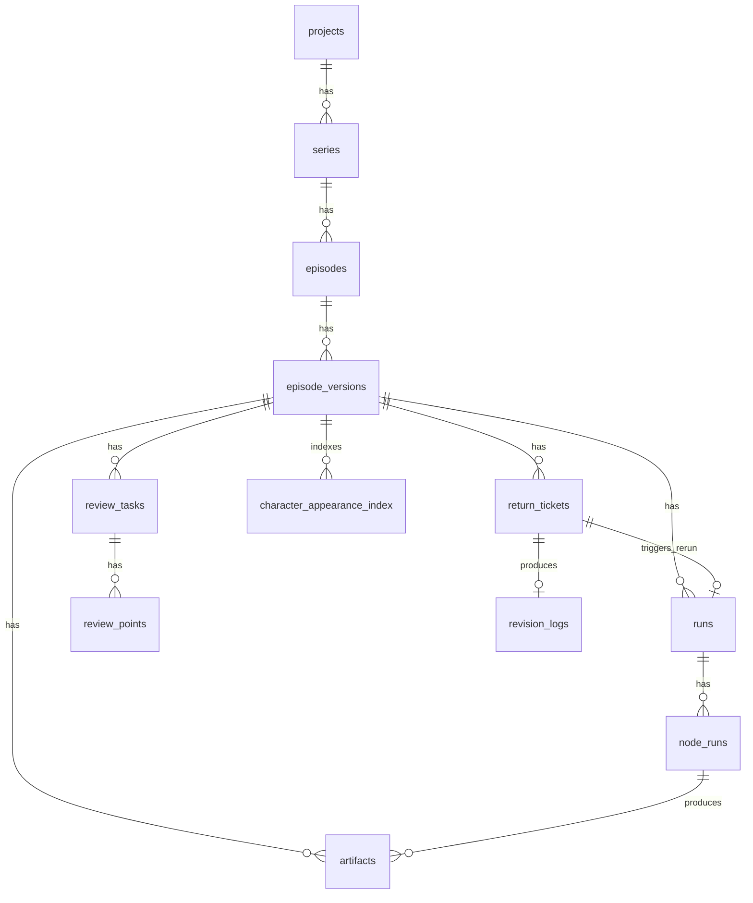

# AIGC 核心产线与超管系统 · 数据结构设计（V2.0）

## 1. 目标

- 支撑 26 节点 LangGraph 多智能体编排与 4 人工 Gate
- 支撑 ReturnTicket 归因与最小重跑（含质检自动打回）
- 支撑 RAG 知识库检索上下文注入
- 支撑成本/效率/质量统计与超管可观测
- 支撑 Reflection / Feedback Learning、双制式交付、审核团队运营与吞吐扩展的后续演进

> 现网兼容说明：
> 线上数据库已存在一批历史审核表，其 `episodes.id`、`shots.id` 仍保留旧字符串主键形态，而编排与审核域大量业务引用已经使用 UUID。
> 因此，本文档中凡标注为“业务引用”的 `episode_id`、`shot_id` 字段，当前线上迁移不会强行加物理外键，而是先保持兼容，待后续统一 ID 体系后再补强 FK。

> 应用层 Schema / 运行时上下文补充说明：
> 从本轮开始，应用层对象契约、运行时上下文层（`EpisodeContext / RunContext / ShotContext`）以及 Schema 到数据库的映射关系，统一收口到同目录下的 `schema-contracts.md`。
> 本文档继续作为数据库真相源与核心持久化结构定义；若两者冲突，以“数据库字段与迁移约束”为准，再回写 `schema-contracts.md` 做应用层适配。

---

## 2. 枚举定义

### 2.1 状态枚举

```sql
CREATE TYPE episode_version_status AS ENUM (
  'created', 'running',
  'wait_review_stage_1', 'wait_review_stage_2',
  'wait_review_stage_3', 'wait_review_stage_4',
  'wait_review_stage_4_step_1',  -- Stage4 质检员审核中（可选）
  'wait_review_stage_4_step_2',  -- Stage4 剪辑中台审核中
  'wait_review_stage_4_step_3',  -- Stage4 合作方审核中
  'approved_stage_1', 'approved_stage_2',
  'approved_stage_3', 'approved_stage_4',
  'returned', 'patching', 'delivered', 'distributed'
);

CREATE TYPE run_status AS ENUM (
  'pending', 'running', 'succeeded', 'failed', 'canceled'
);

CREATE TYPE node_run_status AS ENUM (
  'pending', 'running', 'retrying', 'succeeded',
  'failed', 'canceled', 'skipped', 'partial', 'auto_rejected'
);

CREATE TYPE return_status AS ENUM (
  'open', 'in_progress', 'resolved', 'wontfix'
);
```

### 2.2 业务枚举

```sql
CREATE TYPE severity AS ENUM ('blocker', 'major', 'minor');

CREATE TYPE anchor_type AS ENUM ('asset', 'shot', 'timestamp');

CREATE TYPE issue_type AS ENUM (
  'art_tone', 'character', 'scene', 'prop',
  'kf_quality', 'kf_continuity',
  'vid_quality', 'vid_continuity', 'pace', 'lipsync',
  'sfx', 'bgm', 'tts', 'mix',
  'subtitle', 'compose', 'export',
  'storyboard', 'shot_split'
);

CREATE TYPE stage_group AS ENUM (
  'script', 'storyboard', 'art',
  'keyframe', 'video', 'av', 'final'
);

CREATE TYPE agent_role AS ENUM (
  'supervisor', 'script_analyst', 'director',
  'visual_director', 'quality_guardian',
  'storyboard_planner', 'audio_director'
);

CREATE TYPE reviewer_role AS ENUM (
  'qc_inspector',      -- 质检员
  'middle_platform',   -- 剪辑中台
  'partner'            -- 合作方
);

CREATE TYPE review_granularity AS ENUM (
  'asset',    -- 资产级（Stage1）
  'shot',     -- 分镜/shot级（Stage2）
  'episode'   -- 集级（Stage3/4）
);
```

---

## 3. 核心表

### 3.1 `node_registry`

| 列 | 类型 | 约束 | 说明 |
|---|---|---|---|
| `id` | uuid | pk | 内部主键 |
| `node_id` | text | unique not null | 如 `N01_SCRIPT_EXTRACT` |
| `name` | text | not null | 节点显示名 |
| `stage_group` | stage_group | not null | 阶段分组 |
| `agent_role` | agent_role | null | 主导 Agent 角色（Gate 节点为 null） |
| `is_human_gate` | boolean | not null default false | 是否人审关卡 |
| `depends_on` | jsonb | not null default '[]' | 上游依赖节点 ID 列表 |
| `inputs_schema` | jsonb | not null default '{}' | 输入 JSON Schema |
| `outputs_schema` | jsonb | not null default '{}' | 输出 JSON Schema |
| `retry_policy` | jsonb | not null default '{}' | {max_retries, backoff_s, backoff_multiplier} |
| `timeout_s` | int | not null default 300 | 执行超时 |
| `cost_tags` | jsonb | not null default '[]' | 成本标签 |
| `produces_artifacts` | jsonb | not null default '[]' | 产出 artifact 类型列表 |
| `review_mapping` | text | null | stage_1 / stage_2 / stage_3 / stage_4 |
| `review_steps` | jsonb | not null default '[]' | Gate 审核步骤配置，见下方 JSON 结构 |
| `model_config` | jsonb | not null default '{}' | 模型端点/主备路由 |
| `comfyui_nodes` | jsonb | not null default '[]' | 使用的 ComfyUI 节点名列表 |
| `comfyui_workflow_id` | text | null | ComfyUI 工作流模板 ID |
| `rag_sources` | jsonb | not null default '[]' | RAG 检索配置 [{collection, query_template, top_k}] |
| `quality_threshold` | jsonb | not null default '{}' | 质检阈值 {min_score, auto_reject_to} |
| `estimated_duration_s` | int | null | 预估执行时长 |
| `reject_target_node_id` | text | null | 自动打回目标节点 |
| `max_auto_rejects` | int | not null default 3 | 单次最大自动打回次数（防死循环） |
| `is_active` | boolean | not null default true | 是否启用 |
| `created_at` | timestamptz | not null | 创建时间 |
| `updated_at` | timestamptz | not null | 更新时间 |

索引：
- `idx_node_registry_stage(stage_group, is_human_gate)`
- `idx_node_registry_agent(agent_role)`

### 3.2 `episode_versions`（扩展字段）

| 列 | 类型 | 约束 | 说明 |
|---|---|---|---|
| `status` | episode_version_status | not null | 当前状态 |
| `run_id` | uuid | null | 当前关联的 Run |
| `total_duration_s` | int | null | 全链路总耗时 |
| `total_cost_cny` | numeric(12,2) | null | 总成本 |
| `human_minutes` | int | null | 人工审核耗时 |
| `ai_minutes` | int | null | AI 执行耗时 |
| `return_count_total` | int | not null default 0 | 总打回次数 |
| `return_count_by_stage` | jsonb | not null default '{}' | 按 stage |
| `auto_reject_count` | int | not null default 0 | 自动打回总次数 |
| `first_pass_rate` | numeric(5,2) | null | 首轮通过率 |
| `stage_wait_time` | jsonb | not null default '{}' | 各阶段等待时长 |

### 3.3 `runs`

| 列 | 类型 | 约束 | 说明 |
|---|---|---|---|
| `id` | uuid | pk | 主键 |
| `episode_id` | uuid | 业务引用 | 所属集；当前线上暂不加物理 FK |
| `episode_version_id` | uuid | fk → episode_versions.id | 所属版本 |
| `status` | run_status | not null | 运行状态 |
| `current_node_id` | text | null | 当前节点 |
| `current_stage_no` | smallint | null, check 1~4 | 当前所属主阶段；为 Gate 控制器/审核池查询保留的物理冗余列 |
| `plan_json` | jsonb | not null default '{}' | DAG 执行计划 |
| `is_rerun` | boolean | not null default false | 是否回炉重跑 |
| `rerun_from_ticket_id` | uuid | null, fk → return_tickets.id | 回炉来源 |
| `langgraph_thread_id` | text | null | LangGraph 线程 ID |
| `started_at` | timestamptz | null | 开始时间 |
| `finished_at` | timestamptz | null | 完成时间 |
| `created_at` | timestamptz | not null | 创建时间 |
| `updated_at` | timestamptz | not null | 更新时间 |

索引：
- `idx_runs_episode_version(episode_version_id, created_at desc)`
- `idx_runs_status(status)`

说明：
- `current_stage_no` 与 `current_node_id` 是单向派生关系，属于运行态查询优化字段；写侧更新 `current_node_id` 时应同步维护。

### 3.4 `node_runs`

| 列 | 类型 | 约束 | 说明 |
|---|---|---|---|
| `id` | uuid | pk | 主键 |
| `run_id` | uuid | fk → runs.id | 所属 Run |
| `episode_version_id` | uuid | fk → episode_versions.id | 所属版本 |
| `node_id` | text | not null | 节点 ID |
| `agent_role` | agent_role | null | 执行的 Agent 角色 |
| `status` | node_run_status | not null | 执行状态 |
| `attempt_no` | int | not null default 1 | 尝试次数 |
| `retry_count` | int | not null default 0 | 重试计数 |
| `auto_reject_count` | int | not null default 0 | 质检自动打回次数 |
| `scope_hash` | text | null | 幂等范围哈希 |
| `input_ref` | text | null | 输入引用 |
| `output_ref` | text | null | 输出引用 |
| `model_provider` | text | null | 模型供应商 |
| `model_endpoint` | text | null | 实际调用端点 |
| `comfyui_workflow_id` | text | null | ComfyUI 工作流 ID |
| `api_calls` | int | not null default 0 | API 调用次数 |
| `token_in` | bigint | not null default 0 | 输入 token |
| `token_out` | bigint | not null default 0 | 输出 token |
| `gpu_seconds` | numeric(12,3) | not null default 0 | GPU 秒数 |
| `cost_cny` | numeric(12,2) | not null default 0 | 成本 |
| `rag_query_count` | int | not null default 0 | RAG 检索次数 |
| `quality_score` | numeric(5,2) | null | 质检评分（质检节点） |
| `error_code` | text | null | 错误码 |
| `error_message` | text | null | 错误信息 |
| `tags` | jsonb | not null default '{}' | 附加标签 |
| `started_at` | timestamptz | null | 开始时间 |
| `ended_at` | timestamptz | null | 结束时间 |
| `duration_s` | int | null | 耗时 |
| `created_at` | timestamptz | not null | 创建时间 |
| `updated_at` | timestamptz | not null | 更新时间 |

约束：`unique(run_id, node_id, attempt_no)`

索引：
- `idx_node_runs_version_node(episode_version_id, node_id, created_at desc)`
- `idx_node_runs_status(status, created_at desc)`
- `idx_node_runs_agent(agent_role, created_at desc)`

### 3.5 `artifacts`

| 列 | 类型 | 约束 | 说明 |
|---|---|---|---|
| `id` | uuid | pk | 主键 |
| `episode_version_id` | uuid | fk → episode_versions.id | 所属版本 |
| `node_run_id` | uuid | null, fk → node_runs.id | 产出节点 |
| `artifact_type` | text | not null | keyframe/video/tts/bgm/sfx/subtitle/final_cut/art_asset/storyboard/prompt_json/comfyui_workflow 等 |
| `anchor_type` | anchor_type | not null | 锚点类型 |
| `anchor_id` | uuid | null | 锚点 ID |
| `time_range` | jsonb | null | {start_ms, end_ms} |
| `resource_url` | text | not null | MinIO/TOS 资源地址 |
| `preview_url` | text | null | 预览地址 |
| `score` | numeric(5,2) | null | 质检评分 |
| `score_detail` | jsonb | null | 多模型评分明细 |
| `meta_json` | jsonb | not null default '{}' | 元数据 |
| `created_at` | timestamptz | not null | 创建时间 |

索引：
- `idx_artifacts_version_type(episode_version_id, artifact_type)`
- `idx_artifacts_anchor(anchor_type, anchor_id)`
- `idx_artifacts_node_run(node_run_id)`

### 3.5.1 `model_jobs`

| 列 | 类型 | 约束 | 说明 |
|---|---|---|---|
| `id` | uuid | pk | 主键 |
| `job_id` | text | unique | 外部/网关任务 ID |
| `request_id` | text | null | 幂等/请求标识 |
| `job_type` | text | not null | 任务类型 |
| `episode_id` | uuid | null | 所属集 |
| `episode_version_id` | uuid | null, fk → episode_versions.id | 所属版本 |
| `node_run_id` | uuid | null, fk → core_pipeline.node_runs.id | 触发本次模型任务的节点执行 |
| `node_id` | text | null | 触发节点 ID，便于按节点查询 |
| `stage_no` | smallint | null, check 1~4 | 所属主阶段 |
| `status` | text | not null | queued/running/succeeded/failed/cancelled |
| `provider` | text | null | 模型提供方 |
| `callback_url` | text | null | 回调主题/地址 |
| `request_payload` | jsonb | not null default '{}' | 请求载荷；第一阶段继续承接 candidate 级追溯信息 |
| `result_payload` | jsonb | null | 成功结果 |
| `error_payload` | jsonb | null | 失败结果 |
| `queued_at` | timestamptz | not null | 入队时间 |
| `started_at` | timestamptz | null | 开始时间 |
| `finished_at` | timestamptz | null | 完成时间 |
| `created_at` | timestamptz | not null | 创建时间 |
| `updated_at` | timestamptz | not null | 更新时间 |

索引：
- `idx_model_jobs_episode_stage(episode_id, stage_no, created_at desc)`
- `idx_model_jobs_status(status, created_at desc)`
- `idx_model_jobs_node_run(node_run_id, created_at desc)`
- `idx_model_jobs_episode_version(episode_version_id, created_at desc)`
- `idx_model_jobs_node_id(node_id, created_at desc)`

说明：
- 第一阶段仍遵循 JSON-first：`candidate_set_id` / `candidate_id` 先存于 `request_payload` 与产物 `meta_json`，待查询压力明确后再提升为物理列。

### 3.6 `review_tasks`

> 过渡策略：
> `review_tasks` 是新版人工审核主模型，但当前阶段 `public.stage_tasks` 仍会保留，继续服务旧审核页面、旧任务面板和兼容接口。
> 主管线内部以 `review_tasks` 驱动精细化审核流转；兼容层可按需要把多条 `review_tasks` 聚合/映射回 `stage_tasks`。

每个 Gate 的每个审核步骤对应一条 ReviewTask。
- Stage2 为 **shot 级审核**：每个 shot 创建独立 ReviewTask，全部 approved 后集级放行。
- Stage4 为 **串行 3 步**：每步创建 1 条 ReviewTask。
- 不同集可并行处于不同 Stage，集通过一个 Stage 后立即进入下一角色的审核池。

| 列 | 类型 | 约束 | 说明 |
|---|---|---|---|
| `id` | uuid | pk | 主键 |
| `episode_id` | uuid | 业务引用 | 所属集；当前线上暂不加物理 FK |
| `episode_version_id` | uuid | fk | 所属版本 |
| `stage_no` | smallint | not null | 1~4 |
| `gate_node_id` | text | not null | N08/N18/N21/N24 |
| `review_step_no` | smallint | not null default 1 | 同一 Gate 内的审核步骤序号（Stage4: 1/2/3；Stage2 均为 1） |
| `reviewer_role` | reviewer_role | not null | qc_inspector / middle_platform / partner |
| `review_granularity` | review_granularity | not null | asset / shot / episode |
| `anchor_type` | anchor_type | null | shot（Stage2） / asset（Stage1） / null（episode 级） |
| `anchor_id` | uuid | null | 锚定的 shot_id 或 asset_id（Stage2 必填，其余 null） |
| `status` | text | not null | pending / in_progress / approved / returned / skipped |
| `assignee_id` | uuid | null, fk → users.id | 审核员 |
| `due_at` | timestamptz | null | 截止时间 |
| `priority` | text | not null | 优先级 |
| `openclaw_session_id` | text | null | OpenClaw 会话 ID |
| `payload_json` | jsonb | not null default '{}' | 脱敏后任务载荷 |
| `started_at` | timestamptz | null | 开始时间 |
| `finished_at` | timestamptz | null | 完成时间 |
| `decision` | text | null | approve / return |
| `decision_comment` | text | null | 决策备注 |
| `created_at` | timestamptz | not null | 创建时间 |
| `updated_at` | timestamptz | not null | 更新时间 |

约束：
- `unique(episode_version_id, gate_node_id, review_step_no, anchor_id)` — Stage2 下同一 shot 不重复；Stage4 同一步骤不重复

索引：
- `idx_review_tasks_assignee_status(assignee_id, status, due_at)`
- `idx_review_tasks_version_stage(episode_version_id, stage_no, review_step_no)`
- `idx_review_tasks_role(reviewer_role, status)`
- `idx_review_tasks_anchor(anchor_type, anchor_id)` — 快速查 shot/asset 级审核

Stage2 shot 级聚合查询（伪 SQL）：

```sql
SELECT episode_version_id,
       count(*) FILTER (WHERE status = 'approved') AS approved_count,
       count(*) AS total_count
FROM review_tasks
WHERE gate_node_id = 'N18_VISUAL_HUMAN_GATE'
  AND episode_version_id = :vid
GROUP BY episode_version_id
HAVING count(*) FILTER (WHERE status = 'approved') = count(*);
-- 如果结果非空 → 全部 shot 通过 → 集级放行
```

Gate 审核步骤配置（种子数据）：

| Gate | step_no | reviewer_role | review_granularity | 任务数/集 | 是否可跳过 |
|---|---|---|---|---|---|
| N08 / Stage1 | 1 | middle_platform | asset | 1 | 否 |
| N18 / Stage2 | 1 | qc_inspector | shot | **N（=shot 数）** | 否 |
| N21 / Stage3 | 1 | qc_inspector | episode | 1 | 否 |
| N24 / Stage4 | 1 | qc_inspector | episode | 1 | **是（可选）** |
| N24 / Stage4 | 2 | middle_platform | episode | 1 | 否 |
| N24 / Stage4 | 3 | partner | episode | 1 | 否 |

多集并行说明：审核池按 `reviewer_role` + `status=pending/in_progress` 聚合展示，不同集的不同 Stage 任务混合呈现，审核员可自由选取。

### 3.7 `review_points`

| 列 | 类型 | 约束 | 说明 |
|---|---|---|---|
| `id` | uuid | pk | 主键 |
| `review_task_id` | uuid | fk → review_tasks.id | 所属任务 |
| `episode_version_id` | uuid | fk | 所属版本 |
| `timestamp_ms` | bigint | not null | 时间戳 |
| `issue_type` | issue_type | not null | 问题类型 |
| `severity` | severity | not null default 'major' | 严重程度 |
| `comment` | text | not null | 描述 |
| `screenshot_url` | text | null | 截图 |
| `created_by` | uuid | fk → users.id | 创建人 |
| `created_at` | timestamptz | not null | 创建时间 |

### 3.8 `return_tickets`

| 列 | 类型 | 约束 | 说明 |
|---|---|---|---|
| `id` | uuid | pk | 主键 |
| `episode_id` | uuid | 业务引用 | 所属集；当前线上暂不加物理 FK |
| `episode_version_id` | uuid | fk | 所属版本 |
| `review_task_id` | uuid | null, fk | 来源审核任务（人工打回） |
| `source_type` | text | not null | human_review / auto_qc |
| `source_node_id` | text | null | 自动打回来源节点（如 N03/N11/N15） |
| `stage_no` | smallint | not null | 关卡号 |
| `anchor_type` | anchor_type | not null | 锚点类型 |
| `anchor_id` | uuid | null | 锚点 ID |
| `timestamp_ms` | bigint | null | 时间戳 |
| `issue_type` | issue_type | not null | 问题类型 |
| `severity` | severity | not null | 严重程度 |
| `comment` | text | not null | 描述 |
| `created_by_role` | text | not null | 质检员/中台/合作方/system |
| `suggested_stage_back` | text | null | 人选建议 |
| `system_root_cause_node_id` | text | null | 系统归因 |
| `rerun_plan_json` | jsonb | not null default '{}' | 重跑计划 |
| `status` | return_status | not null default 'open' | 状态 |
| `resolved_version_id` | uuid | null | 解决此 ticket 的新版本 |
| `created_at` | timestamptz | not null | 创建时间 |
| `updated_at` | timestamptz | not null | 更新时间 |

### 3.9 `rag_collections`（RAG 知识库元数据）

| 列 | 类型 | 约束 | 说明 |
|---|---|---|---|
| `id` | uuid | pk | 主键 |
| `collection_name` | text | unique not null | Chroma collection 名（如 director_reference） |
| `description` | text | null | 描述 |
| `source_type` | text | not null | manual_upload / auto_ingest |
| `document_count` | int | not null default 0 | 文档数 |
| `last_synced_at` | timestamptz | null | 最后同步时间 |
| `created_at` | timestamptz | not null | 创建时间 |

### 3.10 `character_appearance_index`

| 列 | 类型 | 约束 | 说明 |
|---|---|---|---|
| `id` | uuid | pk | 主键 |
| `episode_id` | uuid | 业务引用 | 所属集；当前线上暂不加物理 FK |
| `episode_version_id` | uuid | fk | 所属版本 |
| `asset_id` | uuid | not null | 资产 ID |
| `asset_type` | text | not null | character/scene/prop |
| `shot_id` | text | not null | 出现在哪个镜头；当前线上保持与旧 `shots.id` 的字符串兼容 |
| `created_at` | timestamptz | not null | 创建时间 |

约束：`unique(episode_version_id, asset_id, shot_id)`

### 3.11 `revision_logs`（扩展）

| 列 | 类型 | 说明 |
|---|---|---|
| `return_ticket_id` | uuid, fk | 关联打回单 |
| `node_scope_json` | jsonb | 重跑范围 |
| `revision_summary` | text | 脱敏修订总结 |

---

## 4. 关系总览



---

## 5. 关键 JSON 结构

### 5.1 rerun_plan_json

```json
{
  "root_cause_node_id": "N23_FINAL_COMPOSE",
  "rerun_node_ids": ["N23_FINAL_COMPOSE", "N24_FINAL_HUMAN_GATE", "N25_FINAL_FREEZE", "N26_DISTRIBUTION"],
  "scope": {
    "asset_ids": [],
    "shot_ids": ["shot-1"],
    "time_ranges": [{"start_ms": 12000, "end_ms": 18800}]
  },
  "source_type": "human_review",
  "affected_by_baseline_change": false,
  "reasoning": ["issue_type=subtitle -> compose chain"],
  "generated_at": "2026-03-07T00:00:00Z"
}
```

### 5.2 quality_threshold (node_registry)

```json
{
  "min_score": 8.0,
  "auto_reject_to": "N02_EPISODE_SHOT_SPLIT",
  "metric": "weighted_average"
}
```

### 5.3 rag_sources (node_registry)

```json
[
  {
    "collection": "director_reference",
    "query_template": "为剧本'{series_name}'提供导演方案参考",
    "top_k": 5
  },
  {
    "collection": "style_baseline",
    "query_template": "风格基线: {style_tags}",
    "top_k": 3
  }
]
```

### 5.4 model_config (node_registry)

```json
{
  "primary": {
    "provider": "comfyui",
    "endpoint": "http://comfyui-cluster:8188",
    "workflow_id": "art_asset_gen_v1",
    "models": ["FLUX.2_Dev", "Z-Image-Turbo", "FireRed-1.1"]
  },
  "fallback": {
    "provider": "comfyui",
    "endpoint": "http://comfyui-cluster-backup:8188"
  },
  "timeout_s": 600,
  "max_retries": 2
}
```

### 5.5 review_steps (node_registry — 仅 Gate 节点)

```json
[
  {
    "step_no": 1,
    "reviewer_role": "qc_inspector",
    "review_granularity": "episode",
    "skippable": true,
    "description": "质检员审核（可选）"
  },
  {
    "step_no": 2,
    "reviewer_role": "middle_platform",
    "review_granularity": "episode",
    "skippable": false,
    "description": "剪辑中台审核"
  },
  {
    "step_no": 3,
    "reviewer_role": "partner",
    "review_granularity": "episode",
    "skippable": false,
    "description": "合作方审核"
  }
]
```

以上为 N24 (Stage4) 的 `review_steps` 示例。Stage1~3 各只有 1 个步骤。

---

## 6. 与现有审核域对接

| 现有表/概念 | 对接方式 |
|---|---|
| `stage_tasks` | 过渡期继续保留；由 `review_tasks` 聚合/映射，兼容旧任务面板与旧页面假设 |
| `variants` | 继续作为候选产物索引 |
| `model_jobs` | 继续用于模型任务追踪 |
| `revision_logs` | 扩展 `return_ticket_id` 和 `node_scope_json` |

### 6.1 真相源边界

- `core_pipeline.*` 与本文档定义的核心对象，是编排、运行态、回炉、版本、成本、质量、调度的唯一业务真相源。
- `review-workflow` 侧页面 DTO、任务面板状态、页面聚合字段，必须从 core truth objects 派生，不能反向定义核心状态机。
- `stage_tasks` 在过渡期可继续存在，但应被视为审核消费层/兼容层，而不是长期核心真相源。

### 6.2 后续扩展预留

为支持不在 MVP-0 全量落地、但必须在长期路线中存在的主线，本文档要求后续数据层预留以下能力：

- Reflection：
  - 反馈沉淀记录
  - 经验回写版本
  - 命中率 / 采纳率统计
- 质量评测：
  - 角色一致性分
  - 连续性分
  - 音画同步分
  - 成片综合质量分
- 双制式交付：
  - output profile（landscape / portrait / both）
  - safe area / subtitle layout / reframing 策略
- 审核团队运营：
  - reviewer SLA
  - task pool 分配记录
  - 负载均衡与超时统计
- 成本与吞吐：
  - shot 难度等级
  - 路由命中模型
  - 并发批次
  - GPU 配额与预算决策痕迹
