# AIGC 短剧生产线（V1）— 核心产线与超管系统 · 设计文档

## 文档信息

- Spec：`aigc-core-orchestrator-platform`
- 版本：v2.2（对齐 Pipeline v2.2 多智能体架构）
- 依赖：`requirements.md`

---

## 1. 架构设计

### 1.1 系统总览

```text
用户/审核员
  OpenClaw 聊天界面 + Web 时间轴 + 飞书终端
           │
           ▼
┌──────────────────────────────┐
│  Agent Gateway (FastAPI)      │  ← orchestrator Pod
│  LangGraph Orchestrator       │    含 Supervisor（横切守卫）
│  + Review Dispatcher Agent    │
└────────────┬─────────────────┘
             │
             ▼
┌──────────────────────────────┐
│      RocketMQ 任务队列        │  ← 替代 Celery+Redis
└──┬────────┬─────────┬────┬───┘
   │        │         │    │
┌──▼──────┐ │    ┌────▼──┐ │
│闭源 API │ │    │ComfyUI│ │
│Gemini   │ │    │GPU集群│ │
│Claude   │ │    │A800×8 │ │
│GPT 5.4  │ │    │4090D×8│ │
└─────────┘ │    └───────┘ │
       ┌────▼────┐    ┌───▼──────┐
       │生产Agent│    │存储层     │
       │7个+EvoE │    │TOS       │
       │(llm-    │    │Qdrant RAG│
       │ agents) │    │PG+Redis  │
       └─────────┘    └──────────┘
```

### 1.2 组件职责

| 组件 | 职责 |
|---|---|
| **LangGraph Orchestrator** | 状态机调度框架，纯代码逻辑，不调 LLM，不做决策 |
| **Supervisor Agent（横切守卫）** | 成本监控 + 项目需求校验 + 预算分配 + 降级触发 + 合规检查；在 N02/N05/N09/N14/N17/N23 checkpoint 自动触发 |
| **生产 Agents（7 个）** | Script Analyst / Shot Designer / Visual Director / Audio Director / Quality Inspector / Compositor / Review Dispatcher |
| **Evolution Engine** | 自我进化全链路：每日反思 → 每周 prompt 进化 → 持续 RAG 入库 → 按条件 LoRA 训练 |
| **ComfyUI 生成集群** | A800×8 + 4090D×8（16 卡），模型路由器，图像/视频/音频生成引擎 |
| **质检闭环** | 多模型投票打分 + 自动打回判定（Quality Inspector Agent） |
| **RAG 知识库（Qdrant）** | 链路级向量检索：导演参考、历史案例、风格基线、评审规则 |
| **OpenClaw** | 人类审核入口与审核任务管理：聊天界面 + Web 时间轴 + 最小干预交互 |
| **RCA Planner** | 基于规则输出 root cause 与 minimal rerun plan |
| **Analytics** | 汇总成本/效率/质量指标 |
| **Review Gateway** | 向外包/合作方暴露脱敏接口与 DTO |
| **存储层** | MinIO/TOS（素材）+ Qdrant（RAG）+ Redis（状态/锁）+ PostgreSQL（事务） |

### 1.3 技术栈

| 层级 | 选型 |
|---|---|
| 多智能体编排 | **LangGraph**（Supervisor + Worker 模式） |
| 异步任务队列 | **RocketMQ**（火山引擎托管版）— Agent 间通信 + 异步任务调度 |
| 后端 API | FastAPI |
| 存储 | PostgreSQL + Redis + MinIO(本地)/TOS(云) |
| 向量库/RAG | **Qdrant**（自部署在 ECS 上） |
| 人类交互 | **OpenClaw**（聊天界面 + Web 时间轴） |
| 容器 | VKE（火山 Kubernetes） |

补充约束：
- 当前阶段允许受控保留部分闭源模型/API（如 Claude / GPT / Gemini / ElevenLabs 等），但必须明确用途、输入数据边界、替代计划，且不得成为不可替代的核心业务真相源。
- `aigc-core-orchestrator-platform` 是编排、运行态、回炉、版本、成本、质量与调度的唯一核心真相源；`review-workflow` 仅消费由 core 派生的 DTO/API。

### 1.4 模型推理部署架构

| 模型类别 | 代表模型 | 部署形态 | 使用节点 |
|---|---|---|---|
| LLM（闭源，脚本阶段） | Gemini 3.1, Claude Opus 4.6 | Google AI / Anthropic API | N01/N02/N04/N05 |
| LLM（闭源，质检投票） | GPT 5.4, Gemini 3.1, Claude | OpenAI / Google / Anthropic API | N03/N11/N15 |
| LLM（闭源，多模态分析） | Gemini 3.1 | Google AI API | N06/N12/N16 |
| LLM（自部署） | Qwen3-32B（本地兜底）等 | vLLM on GPU / 火山方舟 API | 兜底/离线场景，不作为 v1 主力 |
| LLM（外部API） | Claude, GPT, Gemini | 第三方 API | N03/N11/N15（质检多模型投票） |
| 图像生成 | FLUX.2 Dev, FireRed-1.1, Z-Image-Turbo | ComfyUI 集群（GPU） | N07/N09/N10/N13 |
| 视频生成 | LTX-2.3, Wan2.2, SkyReels, ViVi, Mochi | ComfyUI 集群（GPU） | N14 |
| 运动映射 | HuMo | ComfyUI 集群（GPU） | N14 |
| 人脸一致性 | ReActor, FaceID Checker | ComfyUI 集群 | N11/N15 |
| 物理性检查 | Physics Checker | ComfyUI 集群 | N15 |
| TTS（中文） | CosyVoice | 自部署（GPU） | N20 |
| TTS（英文） | ElevenLabs | 第三方 API | N20 |
| 唇形同步 | LatentSync | 自部署（GPU） | N20 |
| BGM/SFX | Stable Audio 2.5 | 自部署或API | N20 |
| 音频混合 | Geek_AudioMixer | ComfyUI 节点 | N20 |
| 成片合成 | FFmpeg（主力）+ VHS_VideoCombine（辅助） | 服务端 + ComfyUI 节点 | N23 |

### 1.5 北极星导向的系统补充设计

1. 成本控制必须围绕单分钟 `<= 30 元` 设计预算、路由与降级策略，而不是只做事后统计。
2. 系统必须支持横屏/竖屏双制式，相关约束应在镜头规划、字幕布局、最终合成与分发阶段显式建模。
3. 产线设计必须可扩展到初期单日 300 分钟、最终单日 2000+ 分钟，不能只满足单集串行演示。
4. 人类反馈不仅用于触发回炉，还必须进入 Reflection / Feedback Learning 闭环，驱动知识库、规则和工作流持续优化。

---

## 2. Node Registry 设计

### 2.1 完整节点清单（28 执行点 — 含 N07b、N16b）

#### SCRIPT（剧本）

| # | node_id | 名称 | Agent | 模型 | ComfyUI 节点 | 依赖 | 产物 | RAG 输入 | 预估时间 |
|---|---|---|---|---|---|---|---|---|---|
| 1 | N01_SCRIPT_EXTRACT | 主剧本提取 | Script Analyst | Gemini 3.1 / Opus 4.6 | — | 无（起始） | 结构化要素 JSON（角色/场景/情感/节拍/时间线） | 导演助力方案 + 多段落分析 | ~3min |
| 2 | N02_EPISODE_SHOT_SPLIT | LLM拆集拆镜 | Director | Gemini 3.1 / Opus 4.6 | (Shot by Shot, Story) | N01 | 分集拆解 JSON + 镜头列表（按集调用，30-60 shots/集） | — | ~4min |

#### STORYBOARD（分镜）

| # | node_id | 名称 | Agent | 模型 | ComfyUI 节点 | 依赖 | 产物 | RAG 输入 | 预估时间 |
|---|---|---|---|---|---|---|---|---|---|
| 3 | N03_STORYBOARD_QC | 分镜质量检验 | Quality Guardian | GPT 5.4 + Gemini 3.1 + Claude | 穿插题名单 + 历史案例 | N02 | 偏差分析 + 修改建议（阈值 8.0） | 历史案例参考 | ~4min |
| 4 | N04_STORYBOARD_FREEZE | 分镜定稿 | Director | Gemini 3.1 / Opus 4.6 | — | N03(通过) | 定稿分镜 JSON（无 issue 跳过 LLM） | 导演审定方案 | — |
| 5 | N05_SHOT_LEVELING | 镜头分级&编号标注 | Director | Gemini 3.1 / Opus 4.6 | — | N04 | shot_level_map (S0/S1/S2) + qc_tier | 导演模板 + 方案参考 | — |

#### VISUAL ELEMENT & ART（视觉元素与美术）

| # | node_id | 名称 | Agent | 模型 | ComfyUI 节点 | 依赖 | 产物 | RAG 输入 | 预估时间 |
|---|---|---|---|---|---|---|---|---|---|
| 6 | N06_VISUAL_ELEMENT_GEN | 视觉元素生成 | Visual Director | Gemini 3.1 / Opus 4.6 | Text Concat / Prompt Builder | N04 + N05 | **仅 Prompt + ComfyUI 工作流 JSON（不产出图）** | 电影级前置规范 + 等级关联 | — |
| 7 | N07_ART_ASSET_GEN | 美术产品图生成 | Visual Director | FLUX.2 Dev / Z-Image-Turbo + FireRed-1.1 | I-image, Turbo, FireRed MultiRef | N06 | 角色/场景/道具美术图 | 风格参考图像 + 一致性策略 | ~25min |
| 7b | N07b_VOICE_GEN | 核心角色音色生成 | Audio Director | CosyVoice / ElevenLabs | — | N06(角色档案) | CandidateSet\<VoiceSample\>[] 每角色 2-3 候选 | — | ~10min |
| 8 | N08_ART_HUMAN_GATE | 美术产品人类检确 | **Gate: Stage1（仅剪辑中台，资产级 + 音色选定）** | — | Image Preview + Voice Preview | N07 ∥ N07b | ReviewTask（含音色候选） | — | +人工 |
| 9 | N09_ART_FREEZE | 美术产品定稿 | Visual Director | FireRed-1.1 | FireRed + BatchRun | N08(通过) | 高保真固化资产基线 | — | — |

#### KEYFRAME（关键帧）

| # | node_id | 名称 | Agent | 模型 | ComfyUI 节点 | 依赖 | 产物 | RAG 输入 | 预估时间 |
|---|---|---|---|---|---|---|---|---|---|
| 10 | N10_KEYFRAME_GEN | 关键帧生成 | Visual Director | FLUX.2 Dev + FireRed-1.1 | FireRed MultiRef, ControlNet(自动选), NAG | N06 + N09 | 2K 关键帧图像 (per shot) | 关键帧设定 | ~15min |
| 11 | N11_KEYFRAME_QC | 关键帧质检 | Quality Guardian | Gemini + Claude + GPT | ReActor + FaceID Checker | N10 | 多模型评分 JSON | 跨帧对比校验 | ~15min |
| 12 | N12_KEYFRAME_CONTINUITY | 剧情连续性检查 | Quality Inspector | Gemini 3.1 (多模态) | — | N11(通过) | 连续性分析 + 修改建议 | 主剧情上下文联连 | ~10min |
| 13 | N13_KEYFRAME_FREEZE | 关键帧定稿 | Visual Director | FireRed | FireRed Edit | N12 | 固化关键帧 | — | — |

#### VIDEO（视频）

| # | node_id | 名称 | Agent | 模型 | ComfyUI 节点 | 依赖 | 产物 | RAG 输入 | 预估时间 |
|---|---|---|---|---|---|---|---|---|---|
| 14 | N14_VIDEO_GEN | 视频素材生成 | Visual Director | **LTX-2.3**(默认) / Wan2.2 / HuMo(S2条件) | LTXVividGuide Multi, HuMo+Embeds, 模型路由 | N13 | 视频片段 1080p (per shot, 略长+自动裁切) | 动感性映射 | ~80min |
| 15 | N15_VIDEO_QC | 视频素材质检 | Quality Guardian | 多模型 | ReActor + Physics Checker | N14 | 多维度评分 JSON | 动态方面校对 | ~20min |
| 16 | N16_VIDEO_CONTINUITY_PACE | 剧情&节奏连续性 | Shot Designer | Gemini 3.1 (多模态) | — | N15(通过) | PacingReport（节奏分析 + 剪材建议） | 节奏解码 + 方案参考 | ~15min |
| 16b | N16b_TONE_RHYTHM_ADJUST | 影调与节奏调整 | Shot Designer + Compositor(协作) | FFmpeg(剪辑) + Gemini 3.1(决策) | — | N16 | 调整后视频序列 + 更新时间轴 | — | ~10min |
| 17 | N17_VIDEO_FREEZE | 视频素材定稿 | Visual Director | RealESRGAN/Topaz(超分) + FFmpeg | — | N16b | 固化视频片段（含超分） | — | ~10min |
| 18 | N18_VISUAL_HUMAN_GATE | 视觉素材人类检确 | **Gate: Stage2（仅质检员，shot级）** | — | Timeline Preview | N17 | ReviewTask | — | ~10min |
| 19 | N19_VISUAL_FREEZE | 视觉素材定稿 | — | — | — | N18(通过) | 固化视觉素材 | — | — |

#### AV（视听整合）

| # | node_id | 名称 | Agent | 模型 | ComfyUI 节点 | 依赖 | 产物 | 预估时间 |
|---|---|---|---|---|---|---|---|---|
| 20 | N20_AV_INTEGRATE | 视听整合 | Audio Director | TTS:英文→ElevenLabs/中文→CosyVoice + LatentSync + Stable Audio 2.5 | LatentSync, Geek_AudioMixer, SFX/BGM | N19 | 多轨工程+音频+字幕(烧录)+双制式 | ~25min |
| 21 | N21_AV_HUMAN_GATE | 视听整合人类检确 | **Gate: Stage3（仅质检员，episode级）** | — | Audio Timeline Preview | N20 | ReviewTask | ~10min |
| 22 | N22_AV_FREEZE | 视听整合全定稿 | Audio Director | — | — | N21(通过) | 固化视听产物 + STT校验 | ~10min |

#### FINAL（成片）

| # | node_id | 名称 | Agent | 模型 | ComfyUI 节点 | 依赖 | 产物 | 预估时间 |
|---|---|---|---|---|---|---|---|---|
| 23 | N23_FINAL_COMPOSE | 成片整合 | Compositor | FFmpeg(主) + VHS_VideoCombine(辅) | — | N22 | 成片视频(横+竖,≤500MB)+时间轴+字幕烧录+高光闪回(LLM选) | ~15min |
| 24 | N24_FINAL_HUMAN_GATE | 成片人类检确查 | **Gate: Stage4（串行3步：质检员→中台→合作方，episode级）** | — | Video Player + Timeline | N23 | ReviewTask ×3 | ~15min×3 |
| 25 | N25_FINAL_FREEZE | 成片定稿 | Director | — | — | N24(通过) | 成片入池 | ~5min |
| 26 | N26_DISTRIBUTION | TikTok/飞书推送 | Director | — | Feishu + TikTok | N25 | 推送记录 | — |

### 2.2 节点依赖拓扑图

```mermaid
flowchart TD
    N01[N01 剧本提取] --> N02[N02 拆集拆镜]
    N02 --> N03[N03 分镜质检]
    N03 -->|通过| N04[N04 分镜定稿]
    N03 -->|<8.0 打回| N02
    N04 --> N05[N05 镜头分级]
    N05 --> N06[N06 视觉元素生成]
    N04 --> N06
    N06 --> N07[N07 美术图生成]
    N06 --> N07b[N07b 角色音色生成]
    N07 --> N08{N08 Gate Stage1}
    N07b --> N08
    N08 -->|通过| N09[N09 美术定稿]
    N08 -->|打回| N06
    N06 --> N10[N10 关键帧生成]
    N09 --> N10
    N10 --> N11[N11 关键帧质检]
    N11 -->|通过| N12[N12 连续性检查]
    N11 -->|打回| N10
    N12 --> N13[N13 关键帧定稿]
    N13 --> N14[N14 视频生成]
    N14 --> N15[N15 视频质检]
    N15 -->|通过| N16[N16 节奏连续性]
    N15 -->|打回| N14
    N16 --> N16b[N16b 影调节奏调整]
    N16b --> N17[N17 视频定稿]
    N17 --> N18{N18 Gate Stage2}
    N18 -->|通过| N19[N19 视觉定稿]
    N19 --> N20[N20 视听整合]
    N20 --> N21{N21 Gate Stage3}
    N21 -->|通过| N22[N22 视听定稿]
    N22 --> N23[N23 成片整合]
    N23 --> N24{N24 Gate Stage4}
    N24 --> N24S1["N24-Step1 质检员(可选)"]
    N24S1 -->|通过/跳过| N24S2["N24-Step2 剪辑中台"]
    N24S2 -->|通过| N24S3["N24-Step3 合作方"]
    N24S3 -->|通过| N25[N25 成片定稿]
    N24S1 -->|打回| RET4((ReturnTicket))
    N24S2 -->|打回| RET4
    N24S3 -->|打回| RET4
    N25 --> N26[N26 推送]

    style N08 fill:#ff9,stroke:#333
    style N18 fill:#ff9,stroke:#333
    style N21 fill:#ff9,stroke:#333
    style N24 fill:#ff9,stroke:#333
    style N24S1 fill:#ffe0b2,stroke:#e65100
    style N24S2 fill:#ffe0b2,stroke:#e65100
    style N24S3 fill:#ffe0b2,stroke:#e65100
```



---

## 3. 多智能体设计（LangGraph）

### 3.1 Supervisor Agent

- 维护全局 DAG 状态，决定下一步执行哪个 Worker Agent。
- 处理 Gate 挂起/放行事件。
- 处理质检自动打回（阈值判定后重新调度上游 Agent）。
- 异常处理：超时、失败重试、熔断降级。

### 3.2 Worker Agent 调度模型

```text
Supervisor 收到事件（新 Run / NodeRun 完成 / Gate 放行）
  → 查 Node Registry: 下一节点的 agent_role
  → 组装上下文: 上游产物 + RAG 知识 + model_config
  → 分发给对应 Worker Agent
  → Worker 执行: 调用模型/ComfyUI/工具
  → Worker 返回结构化结果
  → Supervisor 更新 NodeRun 状态，推进 DAG
```

### 3.3 RAG 集成

| 组件 | 说明 |
|---|---|
| Qdrant 向量库 | 存储导演参考、历史案例（链路级 RAGChainCase）、风格基线、评审规则、剧本分析模板 |
| 知识入库 | 人工上传 + 系统自动沉淀（通过的案例自动入库） |
| 检索时机 | Worker Agent 执行前，按 `node_registry.rag_sources` 配置检索 |
| 注入方式 | 作为 system prompt / context 注入 LLM 调用 |

### 3.4 OpenClaw 集成

- 4 个 Gate 节点的人类交互通过 OpenClaw 提供，且审核任务管理由 OpenClaw 承载（core 负责真相对象与网关契约）。
- Gate 审核角色与流转规则如下：

| Gate | 审核角色 | 审核层级 | 任务创建方式 | 流转规则 |
|---|---|---|---|---|
| Stage1 / N08 | 仅**剪辑中台** | 资产级 | 1 ReviewTask/集 | 中台通过 → N09 |
| Stage2 / N18 | 仅**质检员** | 分镜/shot级 | **N ReviewTask/集（每 shot 一条）** | 全部 shot approved → 集级放行 → N19 |
| Stage3 / N21 | 仅**质检员** | 集/episode级 | 1 ReviewTask/集 | 质检员通过 → N22 |
| Stage4 / N24 | **质检员**(可选) → **剪辑中台** → **合作方** | 集/episode级 | 串行 3 ReviewTask/集 | 全部通过 → N25 |

- **Stage2 shot 级聚合机制**：
  1. Gate 到达时，为该集每个 shot 创建独立 ReviewTask（`anchor_type=shot`, `anchor_id=shot_id`）
  2. 质检员逐个 shot 审核：通过 → `approved`；打回 → 仅该 shot 生成 ReturnTicket，其他 shot 不受影响
  3. 当所有 shot 的 ReviewTask 均为 `approved` → 系统自动判定集级 Stage2 通过 → 放行

- **Stage4 串行流转**：
  1. 质检员审核（可选，可跳过）→ 通过后流转
  2. 剪辑中台审核 → 通过后流转
  3. 合作方审核 → 通过后放行
  4. **任一步骤打回 → 立即终止后续步骤 → 生成 ReturnTicket → 回炉**

- **多集并行流水线**：
  - 不同集可同时处于不同 Stage，互不阻塞
  - 集 A 通过某 Stage → **立即进入下一 Stage 角色的审核池**
  - Stage4 也是如此：质检员审完集 A(step1) → 集 A 进中台池；质检员可继续审集 B(step1)
  - 审核员在不同集、不同 Stage 之间可自由切换（审核池按角色聚合，不按集锁定）

- 累计 **6 次人工检查**（1+1+1+3，Stage2 按集计 1 次），任何一次不通过都打回重做局部。

- OpenClaw 交互界面：
  - Stage1（N08）：Image Preview — 美术资产图预览确认
  - Stage2（N18）：Timeline Preview — 关键帧+视频时间轴预览（shot 粒度）
  - Stage3（N21）：Audio Timeline Preview — 多轨音频试听（episode 粒度）
  - Stage4（N24）：Video Player + Timeline — 成片播放审视（episode 粒度）

- 角色权限矩阵：

| 功能 | 质检员 | 剪辑中台 | 合作方 |
|---|---|---|---|
| Stage1 通过/打回 | ❌ | ✅ | ❌ |
| Stage2 通过/打回 | ✅ | ❌ | ❌ |
| Stage3 通过/打回 | ✅ | ❌ | ❌ |
| Stage4 通过/打回 | ✅(可选) | ✅ | ✅ |
| 时间戳评论/打点 | ✅ | ✅ | ✅ |
| 时间轴微调 | ✅(仅Stage3) | ✅(Stage3/4可选) | ❌ |
| 修订总结/历史 | ✅ | ✅ | ✅(仅本集、脱敏) |
| 导出/下载 | ✅(可控) | ✅ | ❌ |

### 3.5 Agent Runtime（v2.2 新增）

每个 Agent 基于 `BaseAgent` 类封装五步决策循环：

```python
class BaseAgent:
    async def execute(self, task: NodeTask) -> NodeOutput:
        # ① 理解上下文 — 读取 ShotSpec/场景/角色 + 项目集约束
        context = await self.load_context(task)
        # ② 检索经验 — RAG 召回 + Agent 记忆
        memories = await self.read_memory(scope="project", key_prefix=task.key)
        rag_cases = await self.search_rag(tags=task.retrieval_tags, top_k=3)
        # ③ 选择策略 — prompt 模板/适配器/候选数/模型/成本
        strategy = self.select_strategy(context, memories, rag_cases)
        # ④ 执行+自检
        result = await self.run(strategy)
        # ⑤ 记录+沉淀 — 决策 trace + 高分结果入记忆
        await self.record_trace(task, strategy, result)
        if result.quality_score > 9.0:
            await self.save_memory(key=..., value=...)
        return result
```

### 3.6 Agent 记忆系统（v2.2 新增）

三层记忆解决不同时间尺度的经验积累：

| 记忆层 | 存储位置 | 生命周期 | 用途 |
|---|---|---|---|
| **工作记忆** | LangGraph State | 单次任务执行期间 | 当前镜头上下文、中间计算结果 |
| **项目记忆** | PostgreSQL `agent_memory` 表 | 项目周期 | 角色最佳参数、剧目风格约束等 |
| **长期记忆** | RAG Qdrant + Prompt 资产库 | 永久（跨项目） | 全链路成功案例、prompt 版本历史、风格模式 |

### 3.7 Supervisor 横切守卫 checkpoint（v2.2 新增）

Supervisor 在以下关键 checkpoint 同时校验成本和项目需求：

| 检查点 | 成本校验 | 项目需求校验 | 检查方式 |
|---|---|---|---|
| N02 完成后 | 镜头数→估算总成本 | 时长在平台约束范围内？节奏符合偏好？ | 规则引擎 |
| N05 完成后 | S2 占比→成本风险评估 | 是否有违反合规红线的内容描述？ | 规则+LLM |
| N09 完成后 | 美术候选数→成本 | 画风是否符合平台调性？品牌色匹配？ | LLM 多模态 |
| N14/N17 | 实时累计成本 vs 预算 | 分辨率/画幅/编码/时长符合硬约束？ | 规则引擎 |
| N23 完成后 | 单集总成本结算 | 所有 platform_constraints 满足？ | 规则+LLM |

校验不通过 → 自动生成 QualityIssue → 路由到对应节点修正。

### 3.8 Reflection / Feedback Learning 设计

Reflection 不是对 RAG 的补充说明，而是一条独立能力主线：

1. 输入：
   - 人类审核决策
   - `review_points`
   - `return_tickets`
   - 质检自动打回记录
   - 最终通过版本的正向样本
2. 沉淀：
   - 好案例 / 坏案例
   - 节点级失败模式
   - 角色一致性、节奏、音画同步等问题模式
   - 有效修复策略与无效修复策略
3. 回写：
   - RAG 知识库
   - Prompt 模板
   - `node_registry.model_config`
   - `quality_threshold`
   - rerun planner 的归因规则
4. 约束：
   - 允许不在 MVP-0 全量实现
   - 但数据结构、事件流和后续任务必须预留

### 3.6 模型治理与数据边界

- 自部署模型优先承担核心生产主链。
- 闭源模型在当前阶段允许作为受控能力补充，用于质检投票、效果对照或特定高价值节点。
- 若使用闭源模型，必须记录：
  - 调用节点
  - 输入数据范围
  - 脱敏策略
  - 成本占比
  - 替代计划
- 任何闭源依赖都不得绕过 `Review Gateway`、审计链路与成本采集。

---

## 4. 状态机设计

### 4.1 EpisodeVersion

| 状态 | 触发条件 |
|---|---|
| `CREATED` | 首次创建 or 打回产生 v+1 |
| `RUNNING` | Supervisor Agent 启动 |
| `WAIT_REVIEW_STAGE_1` | N08 到达 |
| `APPROVED_STAGE_1` | Gate 放行 |
| `WAIT_REVIEW_STAGE_2` | N18 到达（为每个 shot 创建 ReviewTask） |
| `APPROVED_STAGE_2` | 所有 shot 的 ReviewTask 均 approved → 集级放行 |
| `WAIT_REVIEW_STAGE_3` | N21 到达 |
| `APPROVED_STAGE_3` | Gate 放行 |
| `WAIT_REVIEW_STAGE_4` | N24 到达（进入串行 3 步审核） |
| `WAIT_REVIEW_STAGE_4_STEP_1` | Stage4 质检员审核中（可选） |
| `WAIT_REVIEW_STAGE_4_STEP_2` | Stage4 剪辑中台审核中 |
| `WAIT_REVIEW_STAGE_4_STEP_3` | Stage4 合作方审核中 |
| `APPROVED_STAGE_4` | Stage4 全部 3 步通过 |
| `RETURNED` | 任意 Gate/步骤驳回 或 质检自动打回 |
| `PATCHING` | rerun_plan 确认 |
| `DELIVERED` | N25 完成 |
| `DISTRIBUTED` | N26 推送完成 |

### 4.2 NodeRun

| 状态 | 说明 |
|---|---|
| `PENDING` | 等待上游完成 |
| `RUNNING` | Worker Agent 执行中 |
| `RETRYING` | 重试中 |
| `SUCCEEDED` | 成功 |
| `FAILED` | 失败 |
| `CANCELED` | 被取消 |
| `SKIPPED` | 被跳过（rerun 时不需要重跑的节点） |
| `PARTIAL` | 部分成功 |
| `AUTO_REJECTED` | 质检低于阈值自动打回 |

幂等键：`episode_version_id + node_id + scope_hash`

---

## 5. 回炉与最小重跑设计

### 5.1 归因映射表（V2 — 对齐新节点编号）

| issue_type | 归因节点 | 重跑链路 |
|---|---|---|
| ART_TONE / CHARACTER / SCENE / PROP | N06 → N07 | N06→N07→N08→… |
| KF_QUALITY / KF_CONTINUITY | N10~N13 | 受影响镜头 N10→…  |
| VID_QUALITY / VID_CONTINUITY / PACE | N14~N17 | 受影响镜头 N14→… |
| LIPSYNC | N20 或 N14 | 取决于实现 |
| SFX / BGM / TTS / MIX | N20~N22 | 视听整合链 |
| SUBTITLE / COMPOSE / EXPORT | N23 | N23→N24→N25→N26 |
| STORYBOARD / SHOT_SPLIT | N02~N04 | 分镜链 + 下游 |

### 5.2 质检自动打回规则

| 质检节点 | 阈值 | 打回目标 |
|---|---|---|
| N03 分镜质检 | <8.0 分 | → N02 |
| N11 关键帧质检 | 加权总分 < 7.5 | → N10 |
| N15 视频质检 | 加权总分 < 7.5 或单维度 < 5.0 | → N14 |

### 5.3 Minimal Rerun Plan

输入：ReturnTicket + 产物索引
输出：`rerun_node_ids` + `rerun_scope` + `new_episode_version_no`

最小化原则：
1. 只重跑受影响的镜头
2. 只重跑归因节点到最近 Gate 的必要链路
3. 资产基线变更 → `character_appearance_index` 影响面扩散

---

## 6. 数据采集与指标设计

### 6.1 NodeRun 采集字段

| 字段 | 说明 |
|---|---|
| `agent_role` | 执行的 Agent 角色 |
| `model_provider` / `model_endpoint` | 模型信息（内部） |
| `comfyui_workflow_id` | 使用的 ComfyUI 工作流（如有） |
| `api_calls` / `token_in` / `token_out` / `gpu_seconds` | 调用统计 |
| `cost_cny` | 成本 |
| `rag_query_count` | RAG 检索次数 |
| `quality_score` | 质检评分（质检节点） |
| `auto_rejected` | 是否被自动打回 |

### 6.2 EpisodeVersion 汇总

含 `stage_wait_time` 拆解：
- 自动生产时间
- Stage1 等待时间（剪辑中台）
- Stage2 等待时间（质检员，shot级）
- Stage3 等待时间（质检员，episode级）
- Stage4 等待时间（拆分为 3 步：质检员 / 剪辑中台 / 合作方）
- 回炉次数与回炉耗时

### 6.3 AI 诊断

规则 + 模板生成，输出 signals + recommendations。

### 6.4 质量评测体系

系统级质量评测至少覆盖以下维度：

| 维度 | 示例指标 | 主要来源 |
|---|---|---|
| 角色一致性 | 角色外观稳定度、跨镜头一致性分 | N07/N10/N11/N15 |
| 叙事连续性 | shot 连贯率、镜头跳变异常率 | N03/N12/N16 |
| 表演与气口 | 台词节奏、口型同步、微表情自然度 | N20/N21 |
| 视听融合 | 配音/BGM/SFX 覆盖与遮挡率、主观评分 | N20/N21/N24 |
| 成片综合质量 | 最终片综合分、合作方驳回原因结构 | N24 / ReturnTicket |

质量评测不是只读分析，而应反向驱动：
- 自动打回阈值
- 模型路由
- rerun 范围判断
- Reflection 入库优先级

### 6.5 审核团队运营与审核池设计

- 审核任务池按 `reviewer_role + status + priority` 聚合。
- 系统必须支持：
  - SLA 统计
  - 超时提醒
  - 任务锁与自动释放
  - reviewer 负载均衡
  - 紧急驳回优先
  - 合作方驳回优先回流
- 目标不是只让页面能看，而是能支撑 15-20 人审核团队协同运行。

### 6.6 双制式交付设计

- 每个 EpisodeVersion 需要携带输出 profile：`landscape` / `portrait` / `both`
- 关键约束包括：
  - 安全构图区域
  - 字幕布局与行数限制
  - 镜头重构图 / 裁切策略
  - 最终导出分辨率与码率
  - 分发平台适配
- 双制式不是最终导出阶段才处理，而应在 N02/N05/N23/N25/N26 等关键节点持续感知。

---

## 7. Review Gateway 设计

### 7.1 原则

- 只暴露四关任务视图
- 不暴露模型供应商、token、GPU、成本
- OpenClaw 作为人类交互前端

### 7.2 核心接口

| 方法 | 路径 | 说明 |
|---|---|---|
| GET | `/gateway/review/tasks?assignee=me` | 拉取待办 |
| GET | `/gateway/review/tasks/{task_id}` | 详情 |
| POST | `/gateway/review/tasks/{task_id}/decision` | 通过/驳回 |
| POST | `/gateway/review/tasks/{task_id}/points` | 打点（Stage3/4） |
| POST | `/gateway/review/tasks/{task_id}/replace` | 替换（Stage3） |
| POST | `/gateway/review/tasks/{task_id}/trim` | 微调（Stage3） |

---

## 8. 超管页面设计

### 8.1 员工质检绩效
超期告警 / 资源池概览 / 周期拆解 / 员工表 / drill-down 详情

### 8.2 全局数据中心
AI 诊断横幅 / 四象限指标 / 趋势图 / 五阶段成本分布 / 明细表

### 8.3 全局生产大盘
统计筛选 / 卡片矩阵 / 右侧节点抽屉

### 8.4 节点调试页
节点树 / Input·Candidates·Output / 运行面板 / 运维动作（不外包）

---

## 9. 接口分层设计

### 9.1 Orchestrator API
| 方法 | 路径 | 说明 |
|---|---|---|
| POST | `/orchestrator/episodes/{id}/run` | 启动/续跑 |
| POST | `/orchestrator/runs/{id}/retry` | 重试节点 |
| POST | `/orchestrator/runs/{id}/cancel` | 取消 |
| GET | `/orchestrator/runs/{id}` | 状态 |

### 9.2 NodeRun API
| 方法 | 路径 | 说明 |
|---|---|---|
| GET | `/noderuns?episode_version_id=...` | 列表 |
| GET | `/noderuns/{id}` | 详情 |
| GET | `/noderuns/{id}/logs` | 日志 |

### 9.3 Return/RCA API
| 方法 | 路径 | 说明 |
|---|---|---|
| POST | `/returns` | 创建 ReturnTicket |
| POST | `/returns/{id}/resolve_plan` | 生成 rerun plan |
| GET | `/returns?episode_id=...` | 列表 |

### 9.4 Admin Analytics API
| 方法 | 路径 | 说明 |
|---|---|---|
| GET | `/admin/metrics/overview` | 四象限 |
| GET | `/admin/metrics/cost_breakdown` | 成本 |
| GET | `/admin/metrics/cycle_breakdown` | 周期 |
| GET | `/admin/staff/performance` | 绩效 |
| GET | `/admin/staff/{id}/detail` | 员工详情 |
| GET | `/admin/series/alerts` | 告警 |
| GET | `/admin/diagnosis` | AI 诊断 |
| GET | `/admin/quality/overview` | 质量评测总览 |
| GET | `/admin/reviewer-ops/overview` | 审核团队运营总览 |
| GET | `/admin/reflection/overview` | Reflection 沉淀与回写情况 |

---

## 10. 风险与缓解

| 风险 | 缓解措施 |
|---|---|
| 回调乱序/重复 | job_id + status 幂等 |
| 回炉范围失控 | 最小重跑规则 + 影响面评估 |
| LangGraph 复杂度 | 先实现线性链，再补并行分支 |
| RAG 检索质量 | 人工审核入库 + 定期清洗 |
| 模型路由抖动 | 主备路由 + 熔断 + 降级 |
| 质检自动打回死循环 | 限制单节点最大打回次数（默认3） |
| 脱敏泄露 | 外部接口强制经 Review Gateway |
