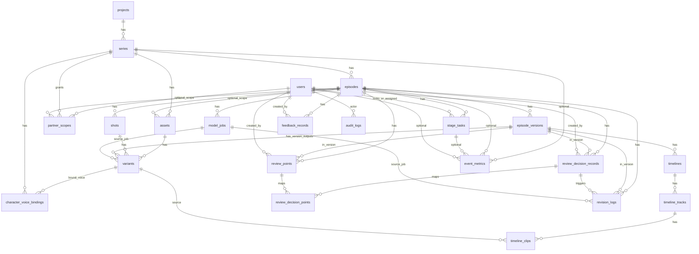

# Autoflow ER 关系图

## 说明

- `episodes.current_version_id` 指向 `episode_versions.id`。
- `assets.selected_variant_id`、`shots.default_*_variant_id` 指向 `variants.id`。
- `variants.episode_version_id` 可用于挂载整集级产物（如 `final_cut`）。
- `stage_tasks` 使用部分唯一索引，确保每个 `(episode_id, stage_no)` 只有一个活跃任务。
