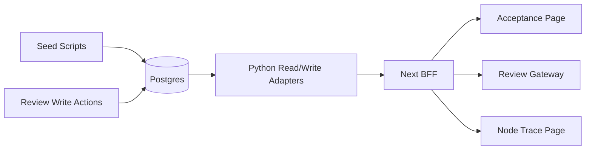

# 2026-03-08 MVP-0 第四轮并行任务

## 任务信息
- 日期：`2026-03-08`
- 轮次：`MVP-0 / 第四轮`
- 主控 Agent：`当前会话主控 Agent`
- 任务状态：`completed`

## 本轮目标
- 把第三轮的“真实数据库读侧可见”推进到“最小真实写侧闭环可操作”。
- 补齐 `node_registry` 与核心运行表的最小种子数据，让验收页、Review Gateway、Node Trace 不再长期依赖空态或 `stage_tasks` 兼容映射。
- 为人审链路增加最小写侧动作，至少支持 `approve / return / skip` 的开发态闭环演示。
- 把 Node Trace 从“顶部状态卡片”升级到“至少一个核心详情区展示真实 `node_runs` 明细”。

## 为什么第四轮先做这个
- 第三轮已经完成真实数据库读侧承接，但核心真相源表仍为空：
  - `core_pipeline.runs = 0`
  - `core_pipeline.node_runs = 0`
  - `public.review_tasks = 0`
  - `core_pipeline.return_tickets = 0`
  - `core_pipeline.node_registry = 0`
- 这意味着当前页面虽然能展示“真实数据库状态”，但还不是真正的业务闭环。
- 如果第四轮继续只做读侧扩展，边际收益会快速下降。
- 最划算的下一步是补“开发态最小真数据 + 最小写侧动作”，让前端、验收页和调试页都能看到真实状态变化。

## 本轮覆盖的 spec 任务编号
- `T2`：Node Registry 与 DAG 校验
- `T3`：Run / NodeRun 状态机
- `T4`：Gate 节点挂起与放行
- `T5`：Artifact 索引与版本固化（仅最小占位，不做完整产物链）
- `T10`：ReturnTicket 与 RCA
- `T11`：Minimal Rerun Planner
- `T12`：回炉与新版本自动创建
- `T20`：节点调试页后端
- `T21`：Review Gateway

## 本轮主线
第四轮不追求完整生产写侧，而是做一个可验证、可继续扩展的开发态最小闭环：

1. 补齐 `node_registry` 26 节点种子与依赖关系。
2. 提供开发态种子/演示脚本，写入一组真实 `runs / node_runs / review_tasks / return_tickets`。
3. 给 `Review Gateway` 增加最小写侧动作：
   - `approve`
   - `return`
   - `skip`
4. 打通“审核动作 -> review_tasks 状态变更 -> return_ticket / rerun_plan / v+1 投影更新 -> 验收页和调试页可见”。
5. 把 `Node Trace` 至少一个核心面板切到真实 `node_runs` 明细，而不是只看顶部摘要。

## 技术路线
- 继续保留 `frontend/app/api/**` 作为 BFF 入口。
- 继续使用 Python 侧作为最小业务承接层，不引入完整 FastAPI 服务。
- 本轮允许非常有限的开发态真实写入，但仅限：
  - 种子/fixture 写入
  - Review Gateway 开发态最小动作写入
- 不做大规模服务化、鉴权体系、生产级并发控制。

## 主要文件
- 验收页：`frontend/app/admin/orchestrator/acceptance/page.tsx`
- 验收页 API：`frontend/app/api/orchestrator/acceptance/route.ts`
- Review Gateway BFF：`frontend/app/api/orchestrator/review/**`
- 调试页：`frontend/app/admin/drama/[id]/page.tsx`
- 前端合同：`frontend/lib/orchestrator-contract-types.ts`
- 总体进度源：`frontend/lib/orchestrator-roadmap-progress.ts`
- 编排读写层：`backend/orchestrator/**`
- 回炉读写层：`backend/rerun/**`
- 公共数据库基础层：`backend/common/**`
- 第四轮目录：`docs/task-launches/2026-03-08-mvp0-fourth-parallel-run/**`

## 实施路径
1. 主控 Agent 创建第四轮任务目录，冻结目标、任务编号、路径边界、禁改共享文件和验收标准。
2. Registry Agent 在 `core_pipeline.node_registry` 准备 26 节点开发态种子方案，并提供可重复执行、幂等的 seed 入口。
3. 数据基建 Agent 在 `backend/common/**` 增加最小写侧工具，统一处理事务、序列化、开发态错误回滚和幂等插入。
4. 编排运行时 Agent 为 `runs / node_runs` 补最小 seed 写入与状态更新路径，至少形成一组“运行中 / 卡 Gate / 已打回”的真实样本。
5. 人审链路 Agent 为 `review_tasks` 增加开发态写侧动作：`approve / return / skip`，并保证 `stage_no`、`review_step_no`、`gate_node_id`、`reviewer_role` 合同不漂移。
6. 回炉与版本 Agent 在 `return_tickets / rerun_plan_json / v+1` 上补最小写侧联动：发生 `return` 后能创建或更新最小回炉结果。
7. Review Gateway Agent 扩展 BFF，使前端可调用真实写侧动作接口，并保留当前读侧接口不破坏。
8. 调试页 Agent 把 `/admin/drama/[id]` 至少一个详情区域改为真实 `node_runs` 数据优先，显示真实 `status / input_ref / output_ref / cost / error`。
9. 验收页 Agent 在第三轮基础上增加第四轮任务 Tab，明确展示“开发态真实写侧闭环”来源，并可看到动作后的状态变化。
10. 主控 Agent 同步更新总体进度、记录逐 Task 验收、补充总验收总结。

## Agent 分工建议
### 主控 Agent
- 目标：
  - 管理第四轮目录与边界冻结
  - 协调种子、写侧动作、验收页与总体进度

### Registry / DAG Agent
- 对应任务：
  - `T2`
- 目标：
  - 补 `node_registry` 26 节点 seed
  - 让 DAG 校验从“空态阻塞”提升为“真实种子可验证”

### 数据基建 Agent
- 对应任务：
  - 公共数据库读写工具
  - seed / fixture 幂等执行器

### 编排运行时 Agent
- 对应任务：
  - `T3` `T4`
- 目标：
  - 为 `runs / node_runs / review_tasks` 提供最小真实写入和状态联动

### 回炉与版本 Agent
- 对应任务：
  - `T10` `T11` `T12`
- 目标：
  - 让 `return` 动作可生成最小 `return_ticket / rerun_plan / v+1`

### Review Gateway Agent
- 对应任务：
  - `T21`
- 目标：
  - 读侧保持稳定
  - 新增最小写侧动作 API

### 调试页 Agent
- 对应任务：
  - `T20`
- 目标：
  - 至少一个详情区用真实 `node_runs` 明细驱动

### 验收页 Agent
- 对应任务：
  - 第四轮任务 Tab
  - 动作后状态展示

## 允许改动路径
- `backend/common/**`
- `backend/orchestrator/**`
- `backend/rerun/**`
- `frontend/app/api/**`
- `frontend/app/admin/orchestrator/acceptance/**`
- `frontend/app/admin/drama/**`
- `frontend/lib/**`
- `docs/task-launches/2026-03-08-mvp0-fourth-parallel-run/**`

## 禁止碰的共享文件
- `.cursor/rules/*.mdc`
- `docs/multi-agent-*.md`
- `.spec-workflow/specs/**`
- 已执行迁移 SQL 与既有 schema 真相源，除非第四轮明确扩 scope
- 外包团队主工作页面，除非本轮单独批准

## 不在本轮范围内
- 完整 FastAPI 服务化改造
- 生产级鉴权、审计、权限体系
- OpenClaw 真服务接入
- ComfyUI / LLM / 音频模型部署
- Data Center 全量真实 API
- 全量 Artifact 产物写入与 TOS 挂载
- 全量自动化测试重构
- 修完所有历史 TypeScript 问题

## 验收标准
- `/admin/orchestrator/acceptance` 仍为统一验收入口，`总体进度` 结构不变
- `独立任务验收` 下新增第四轮任务 Tab，且前几轮 Tab 仍保留
- `node_registry` 不再是空表，DAG 校验能展示真实种子结果
- 页面至少展示一组真实 `runs / node_runs / review_tasks`
- `Review Gateway` 至少有一个真实写侧动作可调用，并造成状态变化
- `return` 后至少能看到最小 `return_ticket / rerun_plan_json / v+1` 联动结果之一
- `/admin/drama/[id]` 至少一个详情区展示真实 `node_runs` 明细，而不只是摘要卡片
- 本轮目录下存在逐 Task 验收记录和总验收总结
- 本轮完成后，总体进度同步更新

## 风险与控制
- 风险：一旦进入写侧，很容易从“最小闭环”扩成“完整后端服务”
- 控制：本轮只允许开发态最小写侧，不做完整生产服务设计
- 风险：真实写入可能污染现有测试数据
- 控制：仅新增隔离的开发态样本；所有 seed 脚本必须幂等，且不得删除用户现有数据
- 风险：写侧联动可能让前端合同快速漂移
- 控制：继续以 `frontend/lib/orchestrator-contract-types.ts` 为接口收口，后端内部映射自行消化
- 风险：第四轮如果同时碰种子、写侧、页面，复杂度显著上升
- 控制：按“seed -> API -> 页面 -> 验收”顺序分层推进

## 预期产出
- 一个新的第四轮任务目录，按既定结构管理
- 一套幂等的开发态 seed / fixture 方案
- 一组不再长期依赖空表的真实 `runs / node_runs / review_tasks` 展示
- 一套最小 Review Gateway 写侧动作 API
- 一个能看到真实 `node_runs` 详情的 Node Trace 页面
- 一轮从“真实读侧”推进到“最小真实写侧闭环”的第四轮主线
